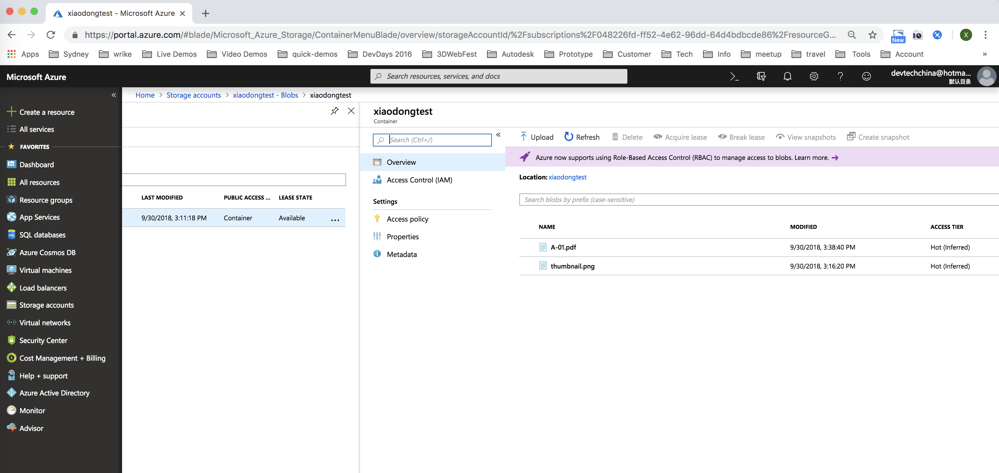

# Design Automation API: Input/Output worflow .NET sample

## Description
This C# sample shows various ways to specify input for a work item of Design Automation

## Thumbnail
 

## Setup

### Dependencies 
* Download and install [Visual Studio](https://visualstudio.microsoft.com/downloads/). In the latest test, Visual Studio version is 2017.
* If you need to test with **SubmitWorkItemWithOutputHeaders** function of [Program.cs](Program.cs), ensure to provide a URL of a presigned place where the result can be uploaded. In this sample, [Azure blob](https://azure.microsoft.com/en-us/services/storage/blobs/) is demoed. Follow the tutorial of [Create and use a SAS with Blob storage](https://docs.microsoft.com/en-us/azure/storage/blobs/storage-dotnet-shared-access-signature-part-2) to generate the url.
      

### Prerequisites
1. **Forge Account**: Learn how to create a Forge Account, activate subscription and create an app at [this tutorial](http://learnforge.autodesk.io/#/account/). Make sure to select the service **Design Automation**.
2. Make a note with the credentials (client id and client secret) of the app. 
3. as mentioned in **Dependencies**, ensure to provide a URL of a presigned place where the result can be uploaded if testing with SubmitWorkItemWithOutputHeaders

## Running locally  

1. Open the project. Restore the packages of the project by [NuGet](https://www.nuget.org/. The simplest way is
  * VS2012: Projects tab >> Enable NuGet Package Restore. Then right click the project>>"Manage NuGet Packages for Solution" >> "Restore" (top right of dialog)
  * VS2013/VS2015/2017:  right click the project>>"Manage NuGet Packages for Solution" >> "Restore" (top right of dialog)
2. Put your Forge credentials in [program.cs](./Program.cs) 
3. Run project **Client**, you will see a status in the console:

4. if everything works well,  the result files and the report files will be downloaded to **MyDocuments**. The result by **SubmitWorkItemWithOutputHeaders** will be uploaded to your Azure blob storage.
 
6. if there is any error with the process of work item, check the report file what error is indicated. 

## Known Issues
* as of writing, Design Automation of Forge is released with version 2. Odata is used with .NET project. In futher version, OData might not be used. 

## Further Reading 
* [Design Automation API help](https://forge.autodesk.com/en/docs/design-automation/v2/developers_guide/overview/)
* [ Intro to Design Automation API Video](https://www.youtube.com/watch?v=GWsJM344CJE&t=107s)
* [Create and use a SAS with Blob storage](https://docs.microsoft.com/en-us/azure/storage/blobs/storage-dotnet-shared-access-signature-part-2) 

## License

These samples are licensed under the terms of the [MIT License](http://opensource.org/licenses/MIT). Please see the [LICENSE](LICENSE) file for full details.

## Written by 

Jonathan Miao & Albert Szilvasy
